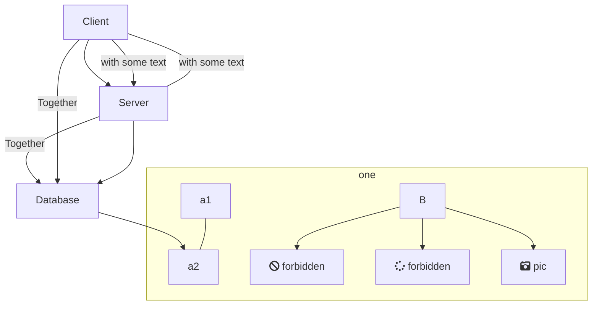
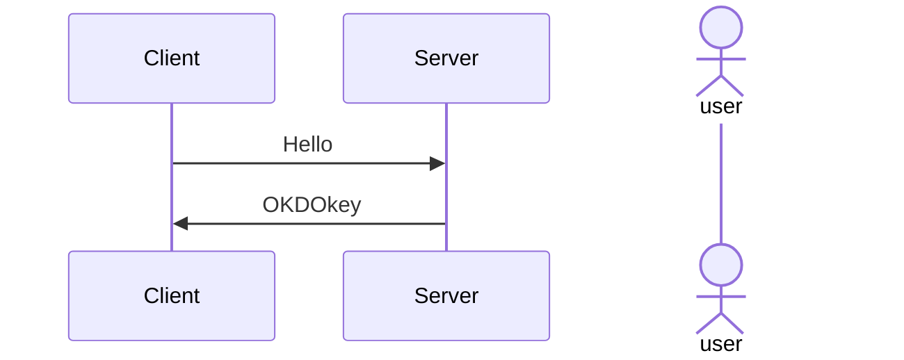
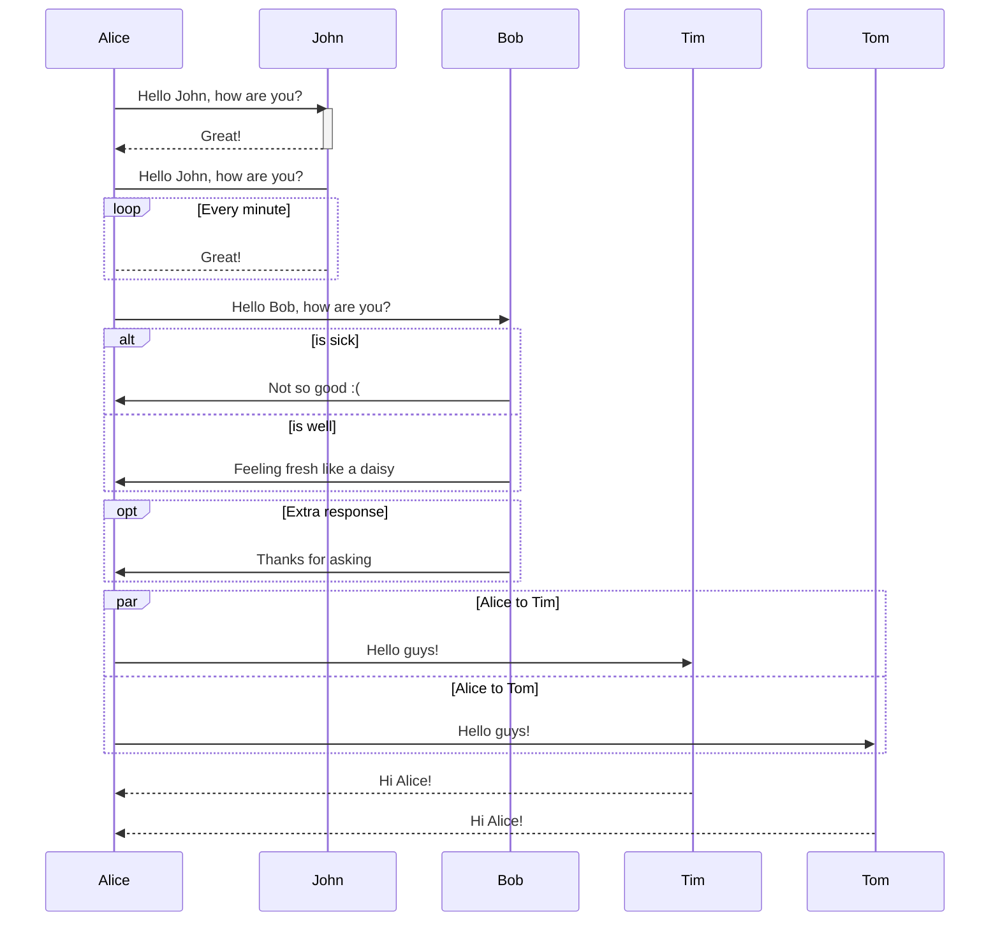

**Mermaid lets you create diagrams and visualizations using text and code.**

Mermaid could be used at illustrating system design with `Flow Chart` , breaking down interact details between components via `Sequence diagram` etc, it also provides `pie`, `gantt` , `git grapth` .

## Experiments

- You could try out in [onlinemermaid](https://mermaid.live/)  or local typora editor

### Flow chart

- LR/TB is for directions, LR means left to right while TB means top down

- brackets around elements decide how it is formed

- interact with [fontawesome](https://fontawesome.com/), list them in [free-icons](https://fontawesome.com/search?m=free)

  

  

### Sequence chart

> Sequence chart contains more interaction details compared to flow chart

- It is possible to activate and deactivate an actor. (de)activation can be dedicated declarations:

